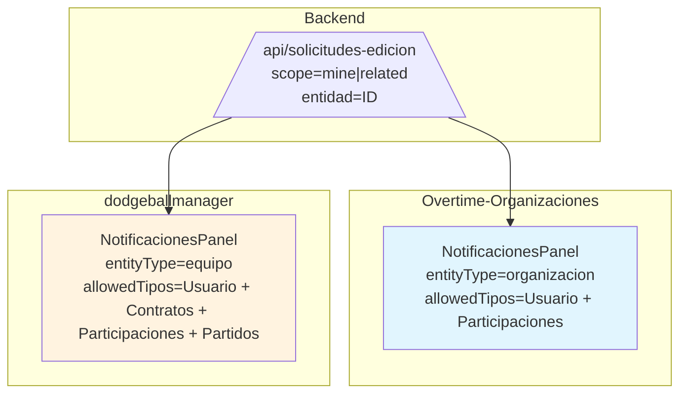

# Plan: Unificación de Componentes de Notificaciones

## Resumen

Crear un componente `NotificacionesPanel` reutilizable en `shared/` que unifique la lógica de las páginas `NotificacionesPage`/`NotificacionesOrgPage` de todos los frontends.

---

## Estado Actual - Los 6 Frontends

| Frontend | Ruta | Página | Tipos Manejados | Context Usado |
|----------|------|--------|-----------------|---------------|
| **Overtime-Admin** | `/notifications` | `NotificacionesPage.tsx` | TODOS (admin global) | `useAuth` |
| **Overtime-Organizaciones** | `/notificaciones` | `NotificacionesOrgPage.tsx` | Usuario-crear, Participaciones | `useOrganizacion` |
| **dodgeballmanager (DT)** | `/notificaciones` | `NotificacionesPage.tsx` | + Contratos, Partidos, Estadísticas | `useAuth`, `useJugador` |
| **Overtime-Manager** | `/notificaciones` | `NotificacionesPage.tsx` | Usuario-crear, Contratos, Partidos | `useAuth`, `useJugador` |
| **Overtime-Public** | `/solicitudes` | `SolicitudesPage.tsx` | Solo CREAR solicitudes (no aprobar) | `useAuth`, `useJugador` |
| **Overtime-Partido** | N/A | Sin página | No necesita | N/A |

### Patrones comunes

- Filtros: estado, categoría, búsqueda, solo mías, entidad
- Tabla con filas expandibles para ver `datosPropuestos`
- Approve/Reject con `getSolicitudAprobadores` para verificar permisos
- Auto-refresh cada 30s
- Paginación server-side (page, limit)

### Diferencias Clave

| Frontend | Puede Aprobar? | Filtro Entidad | showCategoriaFilter | showTipoFilter |
|----------|-----------------|----------------|---------------------|----------------|
| Overtime-Admin | ✅ TODOS | No | Sí | No |
| Overtime-Organizaciones | ✅ Los suyos | Organizacion (fijo) | Sí | No |
| dodgeballmanager (DT) | ✅ Los suyos | Jugador (select) | Sí | No |
| Overtime-Manager | ✅ Los suyos | Jugador (select) | Sí | No |
| Overtime-Public | ❌ NO - solo crea | Jugador (select) | Sí | No |

---

## Arquitectura Propuesta

```
src/shared/features/notificaciones/
├── components/
│   └── NotificacionesPanel.tsx    ← COMPONENTE PRINCIPAL
├── hooks/
│   └── useNotificacionesConfig.ts  ← Configuración por frontend
├── types/
│   └── notificacionesTypes.ts    ← Tipos compartidos
└── index.ts
```

### Props de `NotificacionesPanel`

```typescript
interface NotificacionesPanelProps {
  // Configuración general
  title: string;
  description?: string;
  
  // Filtro de tipos de solicitudes
  allowedTipos: readonly SolicitudEdicionTipo[];
  
  // Configuración de contexto
  entityType: 'organizacion' | 'equipo' | 'jugador' | 'none';
  scope?: 'mine' | 'related' | 'aprobables';
  
  // Permisos
  canApprove: boolean;  // false = solo lectura (Overtime-Public)
  
  // Filtros adicionales
  showTipoFilter?: boolean;        // dodgeballmanager lo tiene
  showCategoriaFilter?: boolean;   // Todos lo tienen
  showEntidadFilter?: boolean;     // Selector de entidad (DT, Manager)
  
  // Callbacks
  onSolicitudUpdate?: (s: SolicitudEdicion) => void;
  onSolicitudCreate?: (s: SolicitudEdicion) => void;
}
```

### Hook `useNotificacionesConfig`

```typescript
interface UseNotificacionesConfigResult {
  // Entity context
  entidadId: string | null;
  entidadNombre: string;
  
  // Filtros activos
  allowedTipos: readonly SolicitudEdicionTipo[];
  scope: 'mine' | 'related';
  
  // Permisos
  canApprove: boolean;
  
  // Categorías por tipo
  categoriaDeTipo: (tipo: SolicitudEdicionTipo) => string;
  
  // Labels
  labelTipo: (tipo: SolicitudEdicionTipo) => string;
}
```

### Configuración por Frontend

```typescript
// Overtime-Admin: TODOS los tipos, admin global
const ADMIN_CONFIG = {
  allowedTipos: Object.keys(tiposSolicitudMeta),
  entityType: 'none' as const,
  canApprove: true,
};

// Overtime-Organizaciones: Usuario-crear + Participaciones
const ORG_CONFIG = {
  allowedTipos: ['usuario-crear-jugador', 'usuario-crear-equipo', 'usuario-crear-organizacion',
    'usuario-solicitar-admin-jugador', 'usuario-solicitar-admin-equipo', 'usuario-solicitar-admin-organizacion',
    'participacion-temporada-crear', 'participacion-temporada-actualizar', 'participacion-temporada-eliminar',
    'jugador-temporada-crear', 'jugador-temporada-actualizar', 'jugador-temporada-eliminar'],
  entityType: 'organizacion' as const,
  canApprove: true,
};

// dodgeballmanager / Overtime-Manager: + Contratos + Partidos
const DT_CONFIG = {
  allowedTipos: ['usuario-crear-jugador', 'usuario-crear-equipo', 'usuario-crear-organizacion',
    'usuario-solicitar-admin-jugador', 'usuario-solicitar-admin-equipo', 'usuario-solicitar-admin-organizacion',
    'jugador-equipo-crear', 'jugador-equipo-eliminar', 'jugador-equipo-editar',
    'participacion-temporada-crear', 'participacion-temporada-actualizar', 'participacion-temporada-eliminar',
    'jugador-temporada-crear', 'jugador-temporada-actualizar', 'jugador-temporada-eliminar',
    'resultadoPartido', 'editarPartidoCompetencia', 'resultadoSet',
    'estadisticasJugadorSet', 'estadisticasJugadorPartido', 'estadisticasEquipoPartido', 'estadisticasEquipoSet'],
  entityType: 'jugador' as const,
  canApprove: true,
};

// Overtime-Public: SOLO crear solicitudes (no aprobar)
const PUBLIC_CONFIG = {
  allowedTipos: ['usuario-crear-jugador', 'usuario-crear-equipo', 'usuario-crear-organizacion',
    'usuario-solicitar-admin-jugador', 'usuario-solicitar-admin-equipo', 'usuario-solicitar-admin-organizacion'],
  entityType: 'jugador' as const,
  canApprove: false,
  showCategoriaFilter: true,
};
```

---

## Diagrama de Flujo



---

## Estructura de Archivos a Crear

```
src/shared/features/notificaciones/
├── components/
│   ├── NotificacionesPanel.tsx
│   ├── NotificacionesFilters.tsx
│   ├── NotificacionesTable.tsx
│   ├── NotificacionesRow.tsx
│   ├── AprobarButton.tsx
│   └── index.ts
├── hooks/
│   ├── useNotificacionesConfig.ts
│   ├── useNotificacionesData.ts
│   └── index.ts
├── types/
│   └── notificacionesTypes.ts
└── index.ts
```

---

## Pasos de Implementación

### Paso 1: Crear tipos compartidos

**`src/shared/features/notificaciones/types/notificacionesTypes.ts`**

```typescript
import type { SolicitudEdicionTipo, SolicitudEdicionEstado, SolicitudEdicion } from '../../solicitudes/types/solicitudesEdicion';

export type EntityType = 'organizacion' | 'equipo' | 'none';
export type Scope = 'mine' | 'related';

export interface NotificacionesPanelProps {
  title: string;
  description?: string;
  allowedTipos: SolicitudEdicionTipo[];
  entityType: EntityType;
  scope?: Scope;
  showTipoFilter?: boolean;
  showCategoriaFilter?: boolean;
  onSolicitudUpdate?: (s: SolicitudEdicion) => void;
}

export interface NotificacionFilterState {
  estado: SolicitudEdicionEstado | 'todos';
  categoria: string;
  tipo: SolicitudEdicionTipo | 'todos';
  query: string;
  soloMias: boolean;
  entidad: string;
  autoRefresh: boolean;
}

export interface NotificacionCategoriaConfig {
  label: string;
  tipos: SolicitudEdicionTipo[];
}
```

### Paso 2: Crear hook de configuración

**`src/shared/features/notificaciones/hooks/useNotificacionesConfig.ts`**

```typescript
import { useOrganizacion } from '../../../../app/providers/OrganizacionContext';
import { useEquipo } from '../../../../app/providers/EquipoContext';
import type { EntityType, Scope, SolicitudEdicionTipo } from '../types/notificacionesTypes';

export function useNotificacionesConfig(
  entityType: EntityType,
  allowedTipos: SolicitudEdicionTipo[],
  scope: Scope = 'related'
) {
  const { organizacionSeleccionada } = useOrganizacion();
  const { equipos } = useEquipo();

  const entidadId = entityType === 'organizacion' 
    ? organizacionSeleccionada?.id ?? null
    : entityType === 'equipo'
    ? null  // Se selecciona dinámicamente
    : null;

  const entidadNombre = entityType === 'organizacion'
    ? organizacionSeleccionada?.nombre ?? ''
    : '';

  return {
    entidadId,
    entidadNombre,
    entidadesDisponibles: entityType === 'equipo' ? equipos : [],
    allowedTipos,
    scope,
  };
}
```

### Paso 3: Crear componente principal

**`src/shared/features/notificaciones/components/NotificacionesPanel.tsx`**

```typescript
import React, { useEffect, useState, useCallback, useMemo } from 'react';
import { useSearchParams } from 'react-router-dom';
import { getSolicitudesEdicion, actualizarSolicitudEdicion, getSolicitudAprobadores } from '../../solicitudes/services/solicitudesEdicionService';
import { useToast } from '../../components/Toast/ToastProvider';
import SolicitudEditModalSimple from '../../solicitudes/components/SolicitudEditModalSimple';
import type { SolicitudEdicion, SolicitudEdicionEstado } from '../../solicitudes/types/solicitudesEdicion';
import type { NotificacionesPanelProps } from '../types/notificacionesTypes';
import { useNotificacionesData } from '../hooks/useNotificacionesData';
import { NotificacionesFilters } from './NotificacionesFilters';
import { NotificacionesTable } from './NotificacionesTable';

export const NotificacionesPanel: React.FC<NotificacionesPanelProps> = ({
  title,
  description,
  allowedTipos,
  entityType,
  scope = 'related',
  showTipoFilter = false,
  showCategoriaFilter = true,
  onSolicitudUpdate,
}) => {
  const { addToast } = useToast();
  const [searchParams, setSearchParams] = useSearchParams();
  
  // Estado
  const [loading, setLoading] = useState(true);
  const [error, setError] = useState<string | null>(null);
  const [solicitudes, setSolicitudes] = useState<SolicitudEdicion[]>([]);
  const [accionando, setAccionando] = useState<string | null>(null);
  const [expanded, setExpanded] = useState<Record<string, boolean>>({});
  const [rechazoEdit, setRechazoEdit] = useState<{ id: string; motivo: string } | null>(null);
  const [openSolicitud, setOpenSolicitud] = useState<null | SolicitudEdicion>(null);
  const [autoRefresh, setAutoRefresh] = useState<boolean>(true);
  
  // Hook de datos
  const { categoriaDeTipo, labelTipo, entidadId } = useNotificacionesData(
    entityType,
    allowedTipos,
    scope
  );

  // Filtros de UI
  const [fEstado, setFEstado] = useState<SolicitudEdicionEstado | 'todos'>(
    (searchParams.get('estado') as SolicitudEdicionEstado) || 'pendiente'
  );
  const [fCategoria, setFCategoria] = useState<string>(searchParams.get('categoria') || 'Todas');
  const [q, setQ] = useState<string>(searchParams.get('q') || '');
  const [fMostrarSoloMias, setFMostrarSoloMias] = useState<boolean>(
    searchParams.get('soloMias') === 'true'
  );
  const [fEntidad, setFEntidad] = useState<string>(searchParams.get('entidad') || 'todas');

  // Cargar datos
  const cargar = useCallback(async () => {
    try {
      setLoading(true);
      setError(null);
      const params: any = {};
      if (fEstado !== 'todos') params.estado = fEstado;
      params.scope = fMostrarSoloMias ? 'mine' : scope;
      if (entidadId) params.entidad = entidadId;
      if (fEntidad !== 'todas') params.entidad = fEntidad;
      
      const data = await getSolicitudesEdicion(params);
      const filtradas = data.solicitudes.filter((s: any) => allowedTipos.has(s.tipo));
      setSolicitudes(filtradas.map((s: any) => ({ ...s, id: s._id })));
    } catch (e: any) {
      setError(e?.message || 'Error al cargar solicitudes');
    } finally {
      setLoading(false);
    }
  }, [fEstado, fMostrarSoloMias, scope, entidadId, fEntidad, allowedTipos]);

  useEffect(() => { void cargar(); }, [cargar]);

  // Auto-refresh
  useEffect(() => {
    if (!autoRefresh) return;
    const id = window.setInterval(() => { void cargar(); }, 30000);
    return () => window.clearInterval(id);
  }, [autoRefresh, cargar]);

  // Sync URL
  useEffect(() => {
    const sp = new URLSearchParams();
    if (fEstado !== 'todos') sp.set('estado', fEstado);
    if (fCategoria !== 'Todas') sp.set('categoria', fCategoria);
    if (q) sp.set('q', q);
    if (fMostrarSoloMias) sp.set('soloMias', 'true');
    if (fEntidad !== 'todas') sp.set('entidad', fEntidad);
    setSearchParams(sp, { replace: true });
  }, [fEstado, fCategoria, q, fMostrarSoloMias, fEntidad, setSearchParams]);

  // Filtrar solicitudes
  const filtradas = useMemo(() => {
    const byCat = (s: SolicitudEdicion) => {
      const cat = categoriaDeTipo(s.tipo);
      if (cat === 'NO_PERMITIDO') return false;
      return fCategoria === 'Todas' ? true : cat === fCategoria;
    };
    const byQ = (s: SolicitudEdicion) => {
      if (!q) return true;
      const txt = `${s.tipo} ${labelTipo(s.tipo)} ${JSON.stringify(s.datosPropuestos || {})}`.toLowerCase();
      return txt.includes(q.toLowerCase());
    };
    return solicitudes.filter((s) => byCat(s) && byQ(s));
  }, [solicitudes, fCategoria, q, categoriaDeTipo, labelTipo]);

  // Acciones
  const manejarAprobar = async (s: SolicitudEdicion) => {
    try {
      setAccionando(s._id);
      const updated = await actualizarSolicitudEdicion(s._id, { estado: 'aceptado' });
      const withId = { ...updated, id: updated._id };
      setSolicitudes((prev) => prev.map((x) => (x._id === s._id ? withId : x)));
      onSolicitudUpdate?.(withId);
      addToast({ type: 'success', title: 'Solicitud aprobada' });
    } catch (e: any) {
      addToast({ type: 'error', title: 'Error al aprobar', message: e?.message });
    } finally {
      setAccionando(null);
    }
  };

  const manejarRechazar = async (s: SolicitudEdicion) => {
    if (!rechazoEdit || rechazoEdit.id !== s._id || !rechazoEdit.motivo.trim()) {
      addToast({ type: 'info', title: 'Ingresá un motivo', message: 'Escribí un motivo y confirmá' });
      return;
    }
    try {
      setAccionando(s._id);
      const updated = await actualizarSolicitudEdicion(s._id, { estado: 'rechazado', motivoRechazo: rechazoEdit.motivo.trim() });
      const withId = { ...updated, id: updated._id };
      setSolicitudes((prev) => prev.map((x) => (x._id === s._id ? withId : x)));
      onSolicitudUpdate?.(withId);
      setRechazoEdit(null);
      addToast({ type: 'success', title: 'Solicitud rechazada' });
    } catch (e: any) {
      addToast({ type: 'error', title: 'Error al rechazar', message: e?.message });
    } finally {
      setAccionando(null);
    }
  };

  const handleOpenEditar = (s: SolicitudEdicion) => setOpenSolicitud(s);
  const handleSaved = (updated: SolicitudEdicion) => {
    setSolicitudes((prev) => prev.map((x) => (x._id === updated._id ? updated : x)));
    onSolicitudUpdate?.(updated);
  };

  // Agrupar por categoría
  const categorias = useMemo(() => {
    const grupos: Record<string, SolicitudEdicion[]> = {};
    for (const s of filtradas) {
      const cat = categoriaDeTipo(s.tipo);
      if (cat === 'NO_PERMITIDO') continue;
      if (!grupos[cat]) grupos[cat] = [];
      grupos[cat].push(s);
    }
    return grupos;
  }, [filtradas, categoriaDeTipo]);

  return (
    <>
      <div className="space-y-6">
        <header className="flex flex-col gap-2">
          <h1 className="text-2xl font-semibold text-slate-900">{title}</h1>
          {description && <p className="text-sm text-slate-500">{description}</p>}
        </header>

        <NotificacionesFilters
          fEstado={fEstado} setFEstado={setFEstado}
          fCategoria={fCategoria} setFCategoria={setFCategoria}
          q={q} setQ={setQ}
          fMostrarSoloMias={fMostrarSoloMias} setFMostrarSoloMias={setFMostrarSoloMias}
          autoRefresh={autoRefresh} setAutoRefresh={setAutoRefresh}
          showCategoriaFilter={showCategoriaFilter}
          onReload={() => void cargar()}
        />

        {loading ? (
          <div className="rounded-xl border border-slate-200 bg-white p-6 text-sm text-slate-600">Cargando…</div>
        ) : error ? (
          <div className="rounded-xl border border-rose-200 bg-rose-50 p-6 text-sm text-rose-800">{error}</div>
        ) : (
          Object.entries(categorias).map(([cat, items]) => (
            <NotificacionesTable
              key={cat}
              categoria={cat}
              items={items}
              labelTipo={labelTipo}
              expanded={expanded}
              setExpanded={setExpanded}
              rechazoEdit={rechazoEdit}
              setRechazoEdit={setRechazoEdit}
              accionando={accionando}
              onAprobar={manejarAprobar}
              onRechazar={manejarRechazar}
              onEditar={handleOpenEditar}
            />
          ))
        )}
      </div>

      {openSolicitud && (
        <SolicitudEditModalSimple
          solicitud={openSolicitud}
          onClose={() => setOpenSolicitud(null)}
          onSaved={handleSaved}
        />
      )}
    </>
  );
};
```

### Paso 4: Crear componentes secundarios

**`NotificacionesFilters.tsx`** - Filtros de la UI
**`NotificacionesTable.tsx`** - Tabla con grouping por categoría
**`NotificacionesRow.tsx`** - Fila individual expandible
**`AprobarButton.tsx`** - Botón de aprobar con verificación de permisos

### Paso 5: Actualizar los 5 frontends

#### 1. Overtime-Admin → Reemplazar `NotificacionesPage.tsx`:

```typescript
import { NotificacionesPanel } from '../../../shared/features/notificaciones';
import { useAuth } from '../../../app/providers/AuthContext';

const TODOS_LOS_TIPOS = Object.keys(tiposSolicitudMeta) as SolicitudEdicionTipo[];

export default function NotificacionesPage() {
  return (
    <NotificacionesPanel
      title="Notificaciones"
      description="Auditoría global de todas las solicitudes del sistema."
      allowedTipos={TODOS_LOS_TIPOS}
      entityType="none"
      canApprove={true}
    />
  );
}
```

#### 2. Overtime-Organizaciones → Reemplazar `NotificacionesOrgPage.tsx`:

```typescript
import { NotificacionesPanel } from '../../../shared/features/notificaciones';
import { useOrganizacion } from '../../../app/providers/OrganizacionContext';

const TIPOS_ORG: readonly SolicitudEdicionTipo[] = [
  'usuario-crear-jugador','usuario-crear-equipo','usuario-crear-organizacion',
  'usuario-solicitar-admin-jugador','usuario-solicitar-admin-equipo','usuario-solicitar-admin-organizacion',
  'participacion-temporada-crear','participacion-temporada-actualizar','participacion-temporada-eliminar',
  'jugador-temporada-crear','jugador-temporada-actualizar','jugador-temporada-eliminar'
];

export default function NotificacionesOrgPage() {
  const { organizacionSeleccionada } = useOrganizacion();
  
  return (
    <NotificacionesPanel
      title="Notificaciones"
      description={`Gestión de solicitudes de ${organizacionSeleccionada?.nombre}`}
      allowedTipos={TIPOS_ORG}
      entityType="organizacion"
      canApprove={true}
    />
  );
}
```

#### 3. dodgeballmanager (DT) → Reemplazar `NotificacionesPage.tsx`:

```typescript
import { NotificacionesPanel } from '../../../shared/features/notificaciones';

const TIPOS_DT: readonly SolicitudEdicionTipo[] = [
  'usuario-crear-jugador','usuario-crear-equipo','usuario-crear-organizacion',
  'usuario-solicitar-admin-jugador','usuario-solicitar-admin-equipo','usuario-solicitar-admin-organizacion',
  'jugador-equipo-crear','jugador-equipo-eliminar','jugador-equipo-editar',
  'participacion-temporada-crear','participacion-temporada-actualizar','participacion-temporada-eliminar',
  'jugador-temporada-crear','jugador-temporada-actualizar','jugador-temporada-eliminar',
  'resultadoPartido','editarPartidoCompetencia','resultadoSet',
  'estadisticasJugadorSet','estadisticasJugadorPartido','estadisticasEquipoPartido','estadisticasEquipoSet'
];

export default function NotificacionesPage() {
  return (
    <NotificacionesPanel
      title="Notificaciones"
      description="Gestioná todas las solicitudes de tu equipo por categoría."
      allowedTipos={TIPOS_DT}
      entityType="equipo"
      showEntidadFilter={true}
      canApprove={true}
    />
  );
}
```

#### 4. Overtime-Manager → Reemplazar `NotificacionesPage.tsx`:

```typescript
import { NotificacionesPanel } from '../../../shared/features/notificaciones';

const TIPOS_MANAGER: readonly SolicitudEdicionTipo[] = [
  'usuario-crear-jugador','usuario-crear-equipo','usuario-crear-organizacion',
  'usuario-solicitar-admin-jugador','usuario-solicitar-admin-equipo','usuario-solicitar-admin-organizacion',
  'jugador-equipo-crear','jugador-equipo-eliminar','jugador-equipo-editar',
  'resultadoPartido','resultadoSet',
  'estadisticasJugadorSet','estadisticasJugadorPartido','estadisticasEquipoPartido','estadisticasEquipoSet'
];

export default function NotificacionesPage() {
  return (
    <NotificacionesPanel
      title="Notificaciones"
      description="Gestioná las solicitudes de tus jugadores."
      allowedTipos={TIPOS_MANAGER}
      entityType="jugador"
      showEntidadFilter={true}
      canApprove={true}
    />
  );
}
```

#### 5. Overtime-Public → Crear nuevo `MisSolicitudesPage.tsx` (renombrar y modificar):

```typescript
import { NotificacionesPanel } from '../../../shared/features/notificaciones';

const TIPOS_PUBLIC: readonly SolicitudEdicionTipo[] = [
  'usuario-crear-jugador','usuario-crear-equipo','usuario-crear-organizacion',
  'usuario-solicitar-admin-jugador','usuario-solicitar-admin-equipo','usuario-solicitar-admin-organizacion',
  'jugador-equipo-crear','jugador-equipo-eliminar','jugador-equipo-editar',
  'jugador-claim'
];

export default function MisSolicitudesPage() {
  return (
    <NotificacionesPanel
      title="Mis Solicitudes"
      description="Historial de solicitudes creadas por ti."
      allowedTipos={TIPOS_PUBLIC}
      entityType="jugador"
      canApprove={false}  // NO puede aprobar - solo crear y ver
      showEntidadFilter={false}
    />
  );
}
```

---

## Categorías por Frontend

| Categoría | Admin | Org | DT | Manager | Public |
|-----------|-------|-----|----|---------|--------|
| Solicitudes de usuarios | ✅ | ✅ | ✅ | ✅ | ✅ |
| Contratos (jugador-equipo) | ✅ | ❌ | ✅ | ✅ | ✅ |
| Participaciones Temporada | ✅ | ✅ | ✅ | ❌ | ❌ |
| Participaciones Jugador-Temporada | ✅ | ✅ | ✅ | ❌ | ❌ |
| Partidos y Estadísticas | ✅ | ❌ | ✅ | ✅ | ❌ |
| Claims | ✅ | ❌ | ❌ | ❌ | ✅ |

---

## Archivos a Crear (11 archivos)

```
src/shared/features/notificaciones/
├── components/
│   ├── NotificacionesPanel.tsx       ← COMPONENTE PRINCIPAL (400+ líneas)
│   ├── NotificacionesFilters.tsx    ← Barra de filtros
│   ├── NotificacionesTable.tsx       ← Tabla agrupada por categoría
│   ├── NotificacionesRow.tsx         ← Fila expandible
│   ├── AprobarButton.tsx             ← Botón con verificación
│   └── index.ts
├── hooks/
│   ├── useNotificacionesConfig.ts    ← Configuración por frontend
│   ├── useNotificacionesData.ts     ← Lógica de datos y categorías
│   └── index.ts
├── types/
│   └── notificacionesTypes.ts
└── index.ts
```

---

## Archivos a Modificar (5 archivos)

| Frontend | Archivo a Modificar | Cambio |
|----------|---------------------|--------|
| Overtime-Admin | `NotificacionesPage.tsx` | Reemplazar por `NotificacionesPanel` |
| Overtime-Organizaciones | `NotificacionesOrgPage.tsx` | Reemplazar por `NotificacionesPanel` |
| dodgeballmanager | `NotificacionesPage.tsx` | Reemplazar por `NotificacionesPanel` |
| Overtime-Manager | `NotificacionesPage.tsx` | Reemplazar por `NotificacionesPanel` |
| Overtime-Public | `SolicitudesPage.tsx` | Renombrar a `MisSolicitudesPage` con `canApprove={false}` |

---

## Validación de Tipos

Usar TypeScript `as const` para asegurar que solo los tipos válidos se pasen:

```typescript
const TIPOS_ORG = [...] as const;
type AllowedOrgTipo = typeof TIPOS_ORG[number];
```

---

## Pruebas a Realizar

### Fase 1: Verificación de Tipos
1. ✅ TypeScript compila sin errores en los 5 frontends
2. ✅ `allowedTipos` solo acepta tipos válidos de `SolicitudEdicionTipo`

### Fase 2: Verificación de Funcionalidad
1. **Overtime-Admin**: Muestra TODAS las solicitudes del sistema, puede aprobar cualquier
2. **Overtime-Organizaciones**: Filtra por `organizacionSeleccionada.id`, solo muestra tipos de Org
3. **dodgeballmanager**: Permite seleccionar jugador del dropdown, muestra tipos de DT
4. **Overtime-Manager**: Igual que dodgeballmanager pero con tipos de Manager
5. **Overtime-Public**: Solo ve sus propias solicitudes, botones de aprobar deshabilitados

### Fase 3: Permisos
1. ✅ `getSolicitudAprobadores` se llama solo para solicitudes pendientes
2. ✅ Botón aprobar muestra estado "loading" mientras verifica
3. ✅ Si `canApprove=false`, no se muestran botones de aprobar/rechazar
4. ✅ Auto-refresh se detiene cuando `autoRefresh=false`

### Fase 4: URL Sync
1. ✅ Filtros de estado, categoría, búsqueda se reflejan en la URL
2. ✅ Recargar con URL mantiene los filtros seleccionados
3. ✅ `soloMias=true` agrega `?scope=mine` a la URL